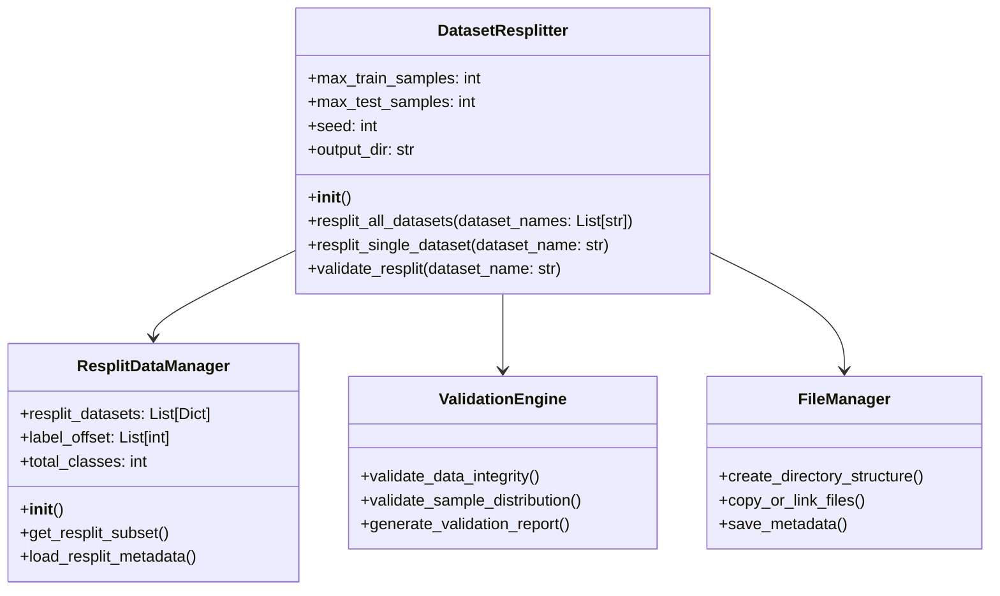
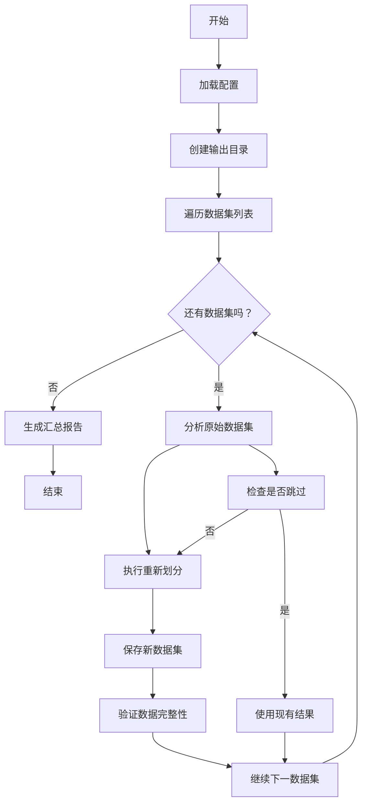
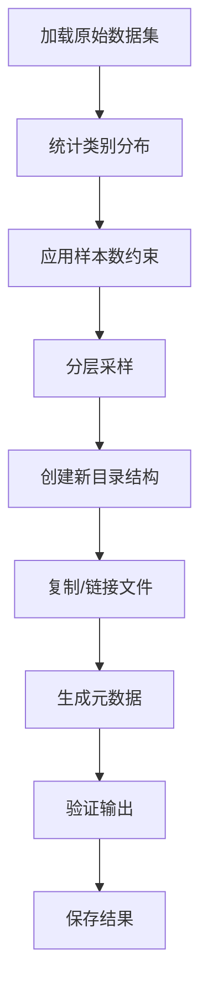

# Cross-Domain数据集重新划分策略设计

## 1. 问题分析

### 1.1 当前问题
- **数据不平衡问题**：不同数据集样本数量差异巨大，测试集样本分布极不均匀
- **系统设计问题**：硬编码路径，数据集列表分散定义
- **可扩展性限制**：添加新数据集需要修改多个文件
- **样本分布问题**：没有对每个类别的样本数进行限制

### 1.2 需求约束
- 测试集每个类别的最大样本数约束到128
- 训练集每个类别的最大样本数约束到128
- 将划分后的数据集保存在新的目录下
- 保持与现有系统的兼容性

## 2. 设计目标

### 2.1 功能目标
- 实现自动化的数据集重新划分
- 支持每类样本数的精确控制
- 保持数据的随机性和可重现性
- 支持多种数据集格式（数组、路径）

### 2.2 技术目标
- 模块化设计，易于扩展
- 与现有CrossDomainDataManager集成
- 完善的错误处理和验证机制
- 高效的内存使用和文件管理

## 3. 重新划分算法设计

### 3.1 核心算法

```python
class DatasetResplitStrategy:
    """数据集重新划分策略类"""
    
    def __init__(self, max_train_samples=128, max_test_samples=128, seed=42):
        self.max_train_samples = max_train_samples
        self.max_test_samples = max_test_samples
        self.seed = seed
    
    def resplit_dataset(self, dataset_info):
        """
        重新划分单个数据集
        """
        # 1. 按类别统计样本
        class_distribution = self._calculate_class_distribution(dataset_info)
        
        # 2. 应用样本数约束
        constrained_distribution = self._apply_sample_constraints(class_distribution)
        
        # 3. 执行分层采样
        train_indices, test_indices = self._stratified_sampling(
            dataset_info, constrained_distribution
        )
        
        # 4. 返回重新划分的结果
        return self._create_resplit_dataset(dataset_info, train_indices, test_indices)
```

### 3.2 分层采样算法

```python
def _stratified_sampling(self, dataset_info, target_distribution):
    """
    执行分层采样以保证每类样本数约束
    """
    import random
    import numpy as np
    
    random.seed(self.seed)
    np.random.seed(self.seed)
    
    train_data = dataset_info['train_data']
    train_targets = dataset_info['train_targets']
    test_data = dataset_info['test_data']
    test_targets = dataset_info['test_targets']
    
    train_indices = []
    test_indices = []
    
    # 对每个类别进行采样
    for class_id in range(dataset_info['num_classes']):
        # 获取该类别的所有样本索引
        train_class_indices = np.where(train_targets == class_id)[0]
        test_class_indices = np.where(test_targets == class_id)[0]
        
        # 随机打乱索引
        np.random.shuffle(train_class_indices)
        np.random.shuffle(test_class_indices)
        
        # 采样指定数量的样本
        train_samples = min(self.max_train_samples, len(train_class_indices))
        test_samples = min(self.max_test_samples, len(test_class_indices))
        
        train_indices.extend(train_class_indices[:train_samples])
        test_indices.extend(test_class_indices[:test_samples])
    
    return train_indices, test_indices
```

## 4. 新目录结构设计

### 4.1 目录组织结构

```
resplit_datasets/
├── config/
│   ├── resplit_config.yaml          # 重新划分配置文件
│   └── dataset_mapping.json         # 数据集映射配置
├── datasets/
│   ├── cifar100_224/
│   │   ├── train/
│   │   │   ├── class_000/           # 按类别组织的训练样本
│   │   │   └── class_001/
│   │   ├── test/
│   │   │   ├── class_000/
│   │   │   └── class_001/
│   │   ├── metadata.json           # 数据集元数据
│   │   └── index.json              # 样本索引文件
│   └── ...
├── scripts/
│   ├── resplit_cross_domain_datasets.py  # 主执行脚本
│   └── validate_resplit.py              # 验证脚本
├── utils/
│   ├── resplit_data_manager.py          # 重新划分数据管理器
│   ├── file_utils.py                    # 文件操作工具
│   └── validation_utils.py              # 验证工具
└── reports/
    ├── resplit_report.json             # 重新划分报告
    └── validation_report.json          # 验证报告
```

### 4.2 元数据文件设计

**metadata.json**：
```json
{
    "dataset_name": "cifar100_224",
    "original_stats": {
        "train_samples": 50000,
        "test_samples": 10000,
        "num_classes": 100
    },
    "resplit_stats": {
        "train_samples": 12800,
        "test_samples": 12800,
        "num_classes": 100,
        "samples_per_class": 128
    },
    "class_mapping": {
        "class_000": "类别名称0",
        "class_001": "类别名称1"
    },
    "resplit_config": {
        "max_train_samples_per_class": 128,
        "max_test_samples_per_class": 128,
        "seed": 42
    }
}
```

## 5. 实现架构设计

### 5.1 类图设计



### 5.2 核心模块职责

#### 5.2.1 DatasetResplitter类
- 协调整个重新划分过程
- 管理配置和参数
- 调用其他模块完成任务

#### 5.2.2 ResplitDataManager类
- 继承现有的CrossDomainDataManagerCore
- 支持新的重新划分数据集格式
- 提供向后兼容性

#### 5.2.3 ValidationEngine类
- 验证数据完整性
- 检查样本分布
- 生成验证报告

#### 5.2.4 FileManager类
- 管理文件和目录操作
- 处理不同的数据格式
- 优化存储和访问

## 6. 流程设计

### 6.1 主流程图



### 6.2 重新划分流程



## 7. 与现有系统的集成方案

### 7.1 扩展CrossDomainDataManager

```python
class CrossDomainResplitDataManager(CrossDomainDataManagerCore):
    """支持重新划分数据集的跨域数据管理器"""
    
    def __init__(self, 
                 dataset_names: List[str],
                 use_resplit: bool = True,
                 resplit_dir: str = "resplit_datasets",
                 **kwargs):
        
        super().__init__(dataset_names, **kwargs)
        self.use_resplit = use_resplit
        self.resplit_dir = resplit_dir
        
        if use_resplit:
            self._load_resplit_metadata()
    
    def _load_resplit_metadata(self):
        """加载重新划分的元数据"""
        self.resplit_metadata = {}
        for dataset_name in self.dataset_names:
            metadata_path = os.path.join(
                self.resplit_dir, "datasets", dataset_name, "metadata.json"
            )
            if os.path.exists(metadata_path):
                with open(metadata_path, 'r') as f:
                    self.resplit_metadata[dataset_name] = json.load(f)
```

### 7.2 配置管理

```python
# config/resplit_config.yaml
resplit_config:
  max_train_samples_per_class: 128
  max_test_samples_per_class: 128
  random_seed: 42
  skip_existing: true
  output_directory: "resplit_datasets"
  
datasets:
  - name: "cifar100_224"
    enabled: true
  - name: "cub200_224"
    enabled: true
  # ... 其他数据集
```

## 8. 质量保证机制

### 8.1 数据完整性验证

```python
def validate_data_integrity(dataset_name, resplit_dir):
    """验证数据完整性"""
    checks = [
        validate_file_count_consistency,
        validate_label_consistency,
        validate_class_distribution,
        validate_image_validity
    ]
    
    results = []
    for check in checks:
        result = check(dataset_name, resplit_dir)
        results.append(result)
    
    return all(results)
```

### 8.2 统计验证

```python
def validate_sample_distribution(dataset_name, resplit_dir):
    """验证样本分布符合约束"""
    metadata = load_metadata(dataset_name, resplit_dir)
    
    # 检查训练集约束
    if metadata['resplit_stats']['train_samples'] > \
       metadata['resplit_config']['max_train_samples_per_class'] * \
       metadata['resplit_stats']['num_classes']:
        raise ValueError(f"Training samples exceed constraint for {dataset_name}")
    
    # 检查测试集约束
    if metadata['resplit_stats']['test_samples'] > \
       metadata['resplit_config']['max_test_samples_per_class'] * \
       metadata['resplit_stats']['num_classes']:
        raise ValueError(f"Test samples exceed constraint for {dataset_name}")
    
    return True
```

### 8.3 异常处理

```python
class ResplitError(Exception):
    """重新划分过程中的异常"""
    pass

def handle_resplit_error(error, dataset_name):
    """处理重新划分错误"""
    error_types = {
        FileNotFoundError: "原始数据集文件未找到",
        ValueError: "数据格式或值错误",
        OSError: "文件系统操作错误"
    }
    
    error_type = type(error)
    error_message = error_types.get(error_type, "未知错误")
    
    logging.error(f"数据集 {dataset_name} 重新划分失败: {error_message}")
    return error_message
```

## 9. 性能优化策略

### 9.1 内存优化
- 使用懒加载机制
- 分批处理大数据集
- 及时释放不需要的数据

### 9.2 并行处理
- 多线程处理多个数据集
- 异步文件操作
- 批量验证操作

### 9.3 存储优化
- 智能文件链接（避免重复复制）
- 压缩存储支持
- 增量更新机制

## 10. 总结

这个重新划分策略设计提供了：

1. **完整的算法框架**：实现了每类样本数约束的分层采样
2. **灵活的架构设计**：模块化、可扩展的实现方案
3. **严格的验证机制**：确保数据质量和完整性
4. **良好的系统集成**：与现有CrossDomainDataManager无缝集成
5. **完善的错误处理**：全面的异常处理和恢复机制

