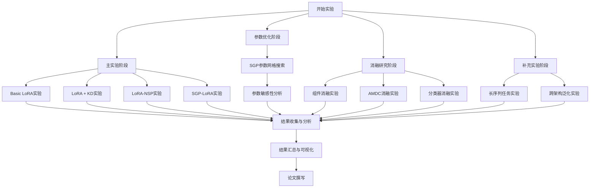
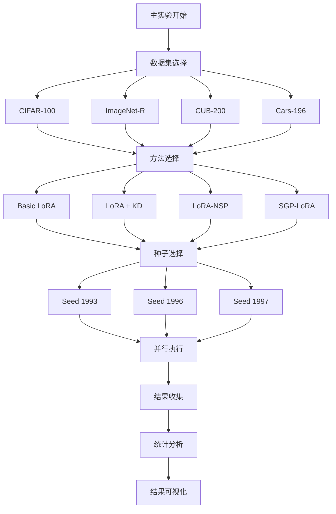
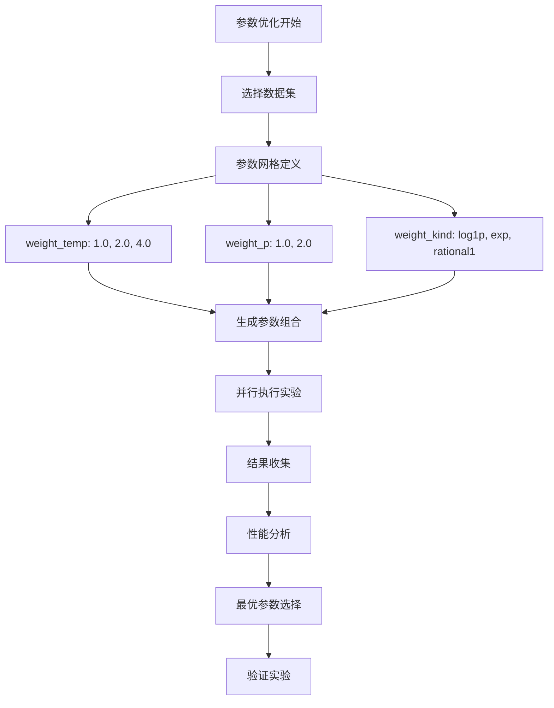
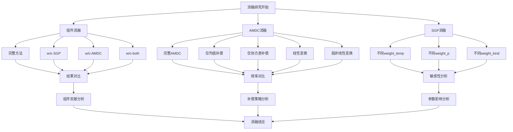
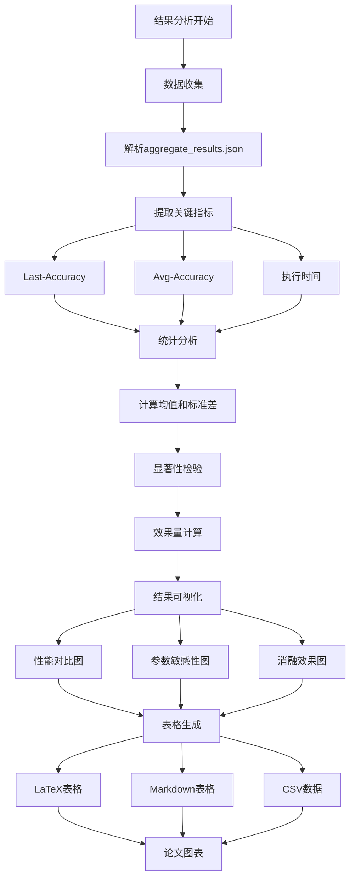
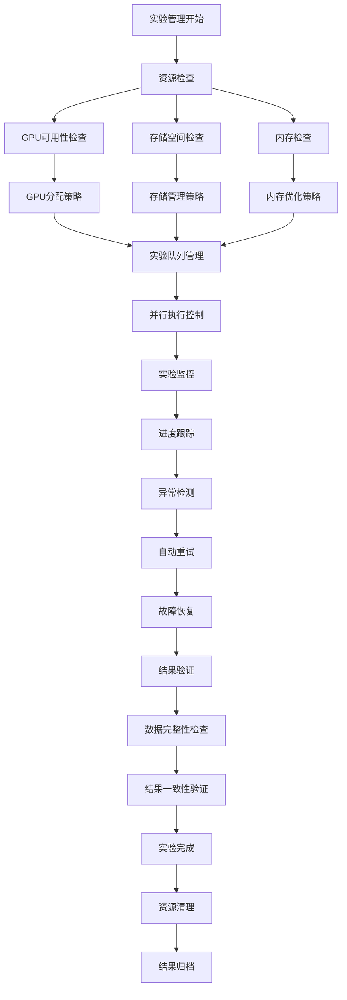
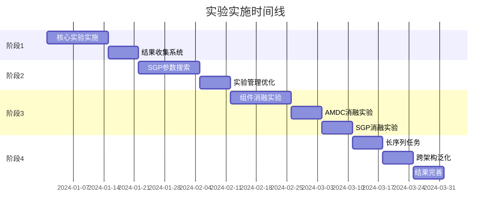

# 实验工作流程图

## 整体实验流程



## 主实验详细流程



## 参数优化流程



## 消融研究流程



## 结果分析流程



## 实验管理流程



## 实施时间线



## 关键决策点

```mermaid
graph TD
    A[实验决策点] --> B{主实验是否成功?}
    
    B -->|是| C[继续参数优化]
    B -->|否| D[问题诊断与修复]
    
    C --> E{参数是否有明显改进?}
    E -->|是| F[继续消融研究]
    E -->|否| G[调整参数范围]
    
    D --> H[检查代码和环境]
    H --> I[重新运行实验]
    I --> B
    
    F --> J{消融结果是否符合预期?}
    J -->|是| K[继续补充实验]
    J -->|否| L[分析方法设计]
    
    G --> M[重新设计参数网格]
    M --> C
    
    K --> N[完成所有实验]
    L --> O[调整消融设计]
    O --> F
    
    N --> P[结果分析与论文撰写]